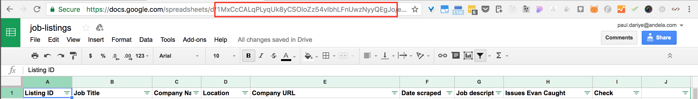

# juliet
A collection of web scraping scripts

## Websites
- [Greenhouse](https://www.greenhouse.io/)
- [Lever](https://www.lever.co/)
- [We Work Remotely](https://weworkremotely.com/)

## Setup

```
gem install bundler   # install bundler dependency manager ( bundler.io )
bundle install        # install deps
```
[Mac OS X Setup Guide](http://sourabhbajaj.com/mac-setup/index.html)

## Keys
You can add keys in `keys.rb` file (request a copy of this file from @pauldariye )
Keys such as
- `*_SHEET_ID         # Google Spreadsheet ID`
- `GOOGLE_API_KEY     # Google Search Key (rate limited)`
- `GOOGLE_SEARCH_CX   # Google Custom Search Paid Key (rate limited :( )`
- `BING_KEY           # BING Search API Key (rate limited) `
- `WWR_URL            # We work remotely key`

### Google Spreadsheet ID


### Google API Key
[Google Custom Search Console](https://cse.google.com/cse/all)
(Request access from @pauldariye)

### Bing Key
[Bind Data Search API](http://datamarket.azure.com/dataset/bing/search)

The columns in row 1 in screenshot above also shows the data that is collected for all the scraps.
[Guide to scraping Greenhouse](https://docs.google.com/document/d/1MavkX0pHW6hHySt0jjDRHxrC6y9P9wp2XMMG9gTj6eA/edit#heading=h.i8azkbec9zxk)

## Usage
```
ruby greenhouse.rb        # Greenhouse
ruby lever.rb             # Lever
ruby we_work_remotely.rb  # We Work Remotely
```
